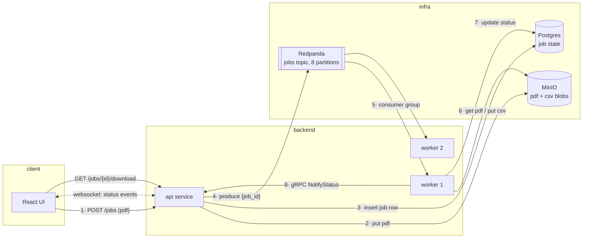
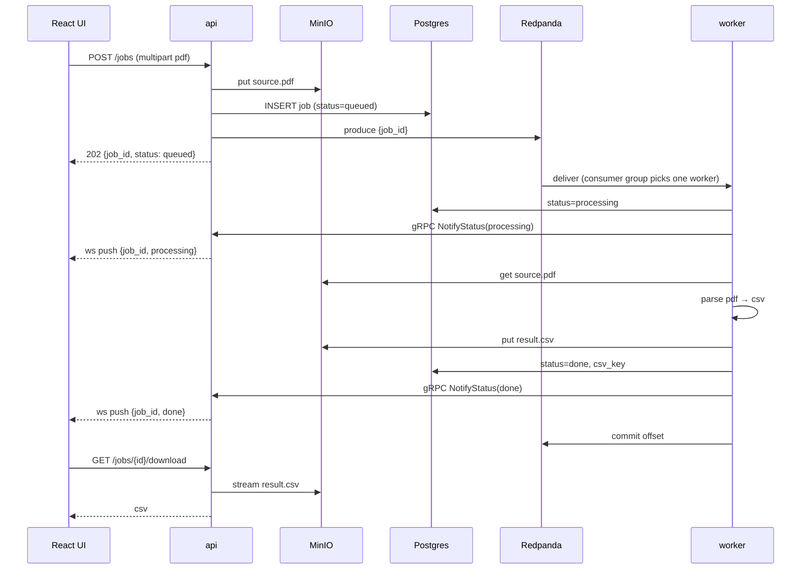

# PDF Transaction Parser

Upload a bank-statement PDF, get it parsed to CSV asynchronously, watch the job status live, download the result.

```bash
docker compose up --build
# open http://localhost:8080
```

## Architecture



Division of labor — each component does the one thing it's good at:

| Component | Role |
|---|---|
| **MinIO (S3)** | The bytes. `jobs/{id}/source.pdf` and `jobs/{id}/result.csv`. Blobs never touch the db or the queue. |
| **Postgres** | The truth. One `jobs` table: status, keys, error, retry count. Queryable any time, survives everything. |
| **Redpanda (Kafka API)** | The dispatch. Messages carry only `{job_id}` — a signal, not data. Buffers backlog, distributes work. |
| **api (Go)** | HTTP: upload, list, download. Websocket fan-out of status events. gRPC server for worker notifications. |
| **worker (Go, ×2)** | Consumes jobs, downloads pdf, parses to csv, uploads result, updates db, notifies api over gRPC. |

## Job lifecycle



Status flow: `queued → processing → done | failed`.

## Design decisions

- **Why the message carries only `job_id`.** Kafka is not a file transport; blobs go to object storage, the queue moves pointers. The worker fetches everything else (pdf from S3, row from Postgres) by id.
- **How two workers never grab the same job.** Kafka consumer groups: each of the topic's 8 partitions is assigned to exactly one consumer. No locks, no flags — the broker's partition assignment *is* the mutual exclusion. Scaling workers (up to partition count) is just adding containers; the group rebalances automatically.
- **At-least-once + failure handling.** Auto-commit is off; a worker commits the offset only after the job reaches a terminal state (`done`/`failed`). A worker that crashes mid-job never committed, so the message is redelivered. `retry_count` in the db caps redelivery: after N attempts the job is marked `failed` permanently with the error text.
- **Why csv goes to S3, not Postgres.** The result is a blob; databases are bad at blobs (table bloat, no streaming, every download through the db connection). Postgres stores the *pointer* (`csv_key`), which is what makes "download it again later" work.
- **Websocket is a hint, not the truth.** Push events can be missed (reconnect, race with subscribe). The UI fetches `GET /jobs` on load/reconnect and treats ws events as incremental updates on top. State in Postgres is authoritative.
- **Kafka honestly considered.** For this scale a Postgres queue (`SELECT … FOR UPDATE SKIP LOCKED`) would suffice. The broker buys push semantics, free work distribution, and backpressure — and it's what the original interview discussed.
- **`PARSE_DELAY`** (worker env, default `2s`): artificial processing delay so the `processing` state is actually visible in a demo; set to `0` for real speed.
- **Compose parallels k8s.** `topic-init` one-shot service ≈ initContainer; `deploy: replicas: 2` ≈ Deployment replicas; healthcheck-gated `depends_on` ≈ readiness probes.

## Repo layout

```
├── docker-compose.yml       # the whole system: infra + services, one command
├── proto/                   # jobs.proto (gRPC contract) + committed generated code
├── services/
│   ├── api/                 # cmd/api, internal/{config,app,...}
│   └── worker/              # cmd/worker, internal/{config,app,...}
├── tools/pdfgen/            # CLI: generates sample statement pdfs + ground-truth csvs
└── web/                     # React UI
```

Go services follow [golang-standards/project-layout](https://github.com/golang-standards/project-layout) (`cmd/` + `internal/`), CLIs are cobra-based, services configure via env vars (12-factor).

## The parsing contract

Real-world pdf parsing is a product in itself (layouts, scans, OCR). This demo scopes it honestly: `tools/pdfgen` generates statements in a fixed layout (`Date | Description | Amount | Balance`), and the worker parses exactly that layout using text extraction. The generator writes a ground-truth `.expected.csv` next to every pdf, which the parser's tests verify against. Uploading an arbitrary real-bank pdf will land the job in `failed` — by design, and the error is visible in the UI.

## Ports

| Service | Port | |
|---|---|---|
| api | 8080 | HTTP + UI |
| api | 9090 | gRPC (internal) |
| MinIO console | 9001 | login `minioadmin`/`minioadmin` |
| Postgres | 5432 | `mls`/`mls`, db `mls` |
| Redpanda | 19092 | external Kafka listener (dev only) |
