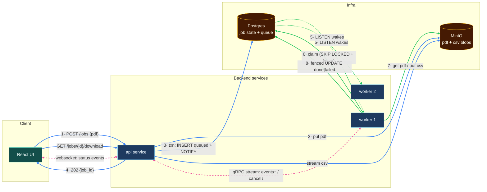
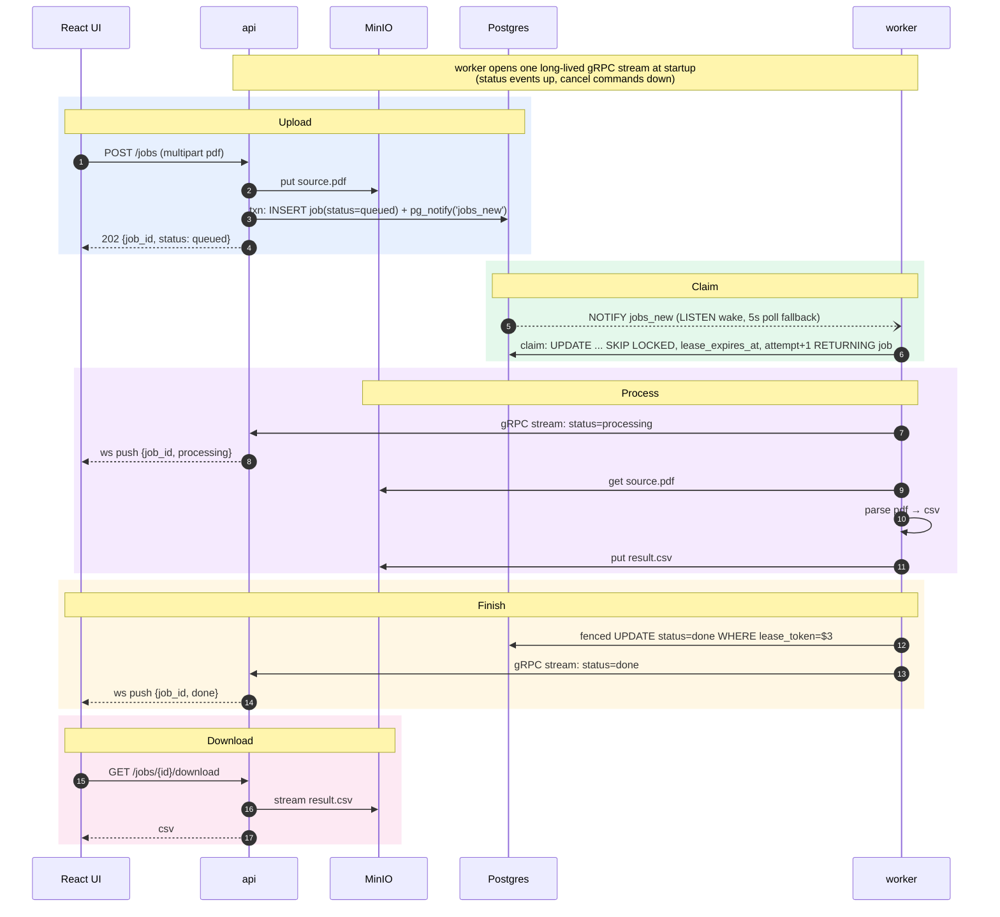

# PDF Transaction Parser

Upload a bank-statement PDF. It gets parsed to CSV in the background. Watch the job status live, download the result.

**The 60-second version.** A React UI talks to a Go `api` service. Postgres holds both the job state and the queue: workers claim jobs with `FOR UPDATE SKIP LOCKED` plus a lease and a fencing token, woken by `LISTEN/NOTIFY` with a 5-second poll fallback. MinIO holds the blobs — pdf in, csv out. Two Go workers each hold one long-lived bidirectional gRPC stream to the api: status events up, cancel commands down. The api pushes status to the UI over a websocket. No broker — at this scale Postgres *is* the queue, and [How it works](#how-it-works) explains why.

## Quick start

**Three ready-to-upload sample statements ship in `./samples/`. `make pdfgen` regenerates them or makes more (requires Go).**

```bash
make up        # build and start everything; open http://localhost:8080
make down      # stop the system, keep data volumes
make pdfgen    # generate sample PDFs
make help      # list all targets
```

* make up runs docker compose up --build -d --wait

`PARSE_DELAY` (worker env, default `2s`) adds artificial processing delay so the `processing` state is visible in a demo. Set to `0` for real speed.

Everything else: see [Make targets](#make-targets).

## Architecture



Each component does the one thing it's good at:

| Component | Role |
|---|---|
| **MinIO (S3)** | The bytes. `jobs/{id}/source.pdf` and `jobs/{id}/result.csv`. Blobs never touch the db. |
| **Postgres** | The truth **and** the queue. One `jobs` table carries status, keys, error, and the lease columns (`attempt`, `lease_token`, `lease_expires_at`). `FOR UPDATE SKIP LOCKED` gives mutual exclusion; `pg_notify` gives wake-up. No second system to keep in sync. |
| **api (Go)** | HTTP: upload, list, download. Writes the pdf to MinIO, then inserts the job row and fires `pg_notify` in one transaction. Fans status events out to the UI over websocket. gRPC server for the workers' streams. |
| **worker (Go, ×2)** | Blocks on `LISTEN jobs_new` (5s poll fallback). Claims a job with `SKIP LOCKED` + a lease, downloads the pdf, parses to csv, uploads the result, finishes with a fenced terminal `UPDATE`. Holds one long-lived gRPC stream to the api: status events up, cancel commands down. |

## Job lifecycle



Status flow: `queued → processing → done | failed` (transient failure: → queued, bounded by attempts).

## How it works

### The queue

- **No dual write, by construction.** The enqueue *is* the `INSERT`. `pg_notify('jobs_new', …)` fires in the same transaction as the row insert. Postgres holds the notification until commit and discards it on rollback — there is no window where the row exists and the signal doesn't. Without this: an earlier version produced to a separate broker after inserting the row; a produce failure after a successful insert stranded the job at `queued` forever, with nothing to notice. The textbook fix is a transactional outbox — but an outbox relay is itself a `SKIP LOCKED` poller over a table. That means building the hard half of a Postgres queue, then handing the easy half to a broker that no longer earns its place.
- **The claim is a lease, not a lock.** The claim query runs `FOR UPDATE SKIP LOCKED` in a transaction that commits immediately — the row lock lives for microseconds, not the 30 seconds a parse takes. Mutual exclusion for the work is carried by the `lease_expires_at` *value*. Without this: holding the transaction open for the job's duration would pin a connection, block vacuum, and bloat the table.
- **NOTIFY is an optimization, not a correctness dependency.** Postgres notifications are connection-scoped and not durable. They need a dedicated unpooled connection (PgBouncer in transaction mode silently drops `LISTEN` registrations), and a subscriber that isn't connected at delivery time misses the event with no replay. So the worker loop doesn't depend on them: claim in a tight loop until empty, block on `WaitForNotification` with a 5-second timeout, loop again. Losing every notification costs up to 5 seconds of latency and never costs a job. Correctness comes entirely from the claim query.

### Failure handling

- **Crash recovery is lease expiry, not a special code path.** A worker killed mid-parse leaves its row at `processing` with a lease about to expire. The same claim query reclaims it once `lease_expires_at < now()` — no separate requeue logic. `attempt` bounds the retries; a small janitor (one `UPDATE` on a ticker) moves rows at-or-above `max_attempts` to `failed` so they stop being reclaimed.
- **The fencing token.** A worker that's alive but partitioned from the db doesn't know its lease expired, so a second worker can legitimately claim the same job — both now run. The terminal write is fenced on the lease:

  ```sql
  UPDATE jobs SET
      status = 'done', csv_key = $3, error = NULL,
      lease_token = NULL, lease_expires_at = NULL, updated_at = now()
  WHERE id = $1 AND lease_token = $2::uuid
  ```

  The stale worker's write matches zero rows, and it knows it lost the race. The duplicate MinIO write is harmless because the csv key is deterministic (`jobs/{id}/result.csv`) — at-least-once delivery, effectively-once effects.

### Storage

- **Write the blob before the pointer.** `api` puts the pdf to MinIO *before* inserting the job row. A crash between the two steps leaves an orphaned object with no row pointing at it — garbage, cleanable by a lifecycle rule. The reverse order would produce a job the worker can claim but whose source pdf doesn't exist — a correctness bug, not a janitorial one. Commit the pointer last.
- **CSV goes to MinIO, not Postgres.** The result is a blob, and databases are bad at blobs: table bloat, no streaming, every download proxied through a db connection. Postgres stores the *pointer* (`csv_key`) — that's what makes "download it again later" work.

### The realtime paths

- **Why gRPC is a stream, not a unary call.** A fire-and-forget `NotifyStatus` RPC is barely more than an HTTP POST — and invites "why not have the api `LISTEN` too?" Because `pg_notify` is a broadcast primitive and cancellation is a routing problem: when a user clicks Cancel, the api must reach the *one* worker holding that job's lease, not every worker. So each worker opens a single long-lived bidirectional stream at startup — status events up, cancel commands down. One connection instead of one dial per event, worker liveness for free (stream closes → worker is gone, and could shorten that worker's leases — not implemented here, lease expiry already covers it), and a real reconnect-with-backoff story.
- **Websocket is a hint, not the truth.** Push events can be missed (reconnect, race with subscribe). The UI fetches `GET /jobs` on load and reconnect, then treats ws events as incremental updates. State in Postgres is authoritative.

### Why no broker

- **Why Kafka was removed.** Kafka's offset model is a replayable-log high-water mark; a work queue needs per-message ack. Bridging the two is real, subtle code — abandon-the-fetch-batch logic, stall backoff, a two-phase requeue dance — all compensating for the central abstraction being wrong for the job.
- **What would bring a broker back.** Specific thresholds: a sustained enqueue rate past what one Postgres instance can claim against, a second independent consumer group needing the same event stream, or an actual replay/retention requirement. At *this* scale I'd pick NATS JetStream over Kafka: `WorkQueuePolicy` retention deletes a message on ack (an actual queue, not a log pretending to be one), per-message `AckWait` redelivery and `MaxDeliver` replace the hand-rolled retry, consumers aren't capped by partition count, and it ships as a single ~20MB binary.
- **In production I'd use [River](https://riverqueue.com/)** rather than hand-rolling `SKIP LOCKED` + leases. I wrote it out here because the claim/lease/fencing/retry story is the interesting part of this exercise — River's whole point is that you never think about it.

**Compose parallels k8s.** `deploy: replicas: 2` ≈ Deployment replicas; healthcheck-gated `depends_on` ≈ readiness probes.

## The parsing contract

Real-world pdf parsing is a product in itself (layouts, scans, OCR). This demo scopes it honestly: `tools/pdfgen` generates statements in a fixed layout (`Date | Description | Amount | Balance`), and the worker parses exactly that layout using text extraction.

What guarantees the two agree is pdfgen's round-trip test. It renders a statement, extracts it back with the same library the worker uses (`ledongthuc/pdf`), and asserts every cell of every page comes out byte-identical — title, account line, period line, four column headers, four cells per row, page footer. That extracted cell sequence *is* the contract the parser codes against. On the worker side, `internal/parser` parses committed fixture pdfs and checks shape, field formats, and pinned first/last rows.

Uploading an arbitrary real-bank pdf lands the job in `failed` — by design, with the error visible in the UI.

## Repo layout

```
├── docker-compose.yml       # the whole system: infra + services, one command
├── Makefile                 # build targets
├── go.work                  # workspace for Go modules
├── proto/                   # jobs.proto (gRPC contract) + committed generated code
├── samples/                 # committed sample statement pdfs
├── services/
│   ├── api/                 # cmd/api, internal/{config,app,...}
│   └── worker/              # cmd/worker, internal/{config,app,...}
├── tools/pdfgen/            # CLI: generates sample statement pdfs in the parser's layout
└── web/                     # React UI
```

Go services follow [golang-standards/project-layout](https://github.com/golang-standards/project-layout) (`cmd/` + `internal/`), CLIs are cobra-based, services configure via env vars (12-factor).

## Make targets

| Target | What |
|---|---|
| **up** | Build and start the whole system with Docker Compose |
| **down** | Stop the system, keep data volumes |
| **clean** | Stop the system and delete data volumes |
| **build** | Go build all modules |
| **test** | Go test all modules |
| **vet** | Go vet all modules |
| **proto** | Regenerate gRPC code from proto/jobs.proto |
| **web** | Build the React UI locally into web/dist |
| **pdfgen** | Generate sample statement PDFs |
| **help** | List all targets |

`make pdfgen` accepts overrides: `COUNT=10 PAGES=2 ROWS=25 SEED=42` (e.g. `make pdfgen COUNT=10`).

**For reviewers:** `make up` is all you need — it builds and starts the system with one command.

## Ports

| Service | Port | |
|---|---|---|
| api | 8080 | HTTP + UI |
| api | 9090 | gRPC (internal) |
| MinIO S3 API | 9000 | object storage |
| MinIO console | 9001 | login `minioadmin`/`minioadmin` |
| Postgres | 5432 | `mls`/`mls`, db `mls` |
