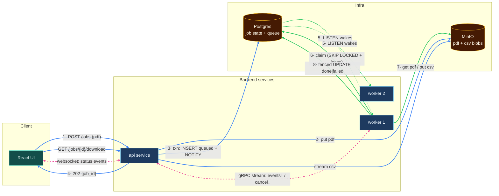
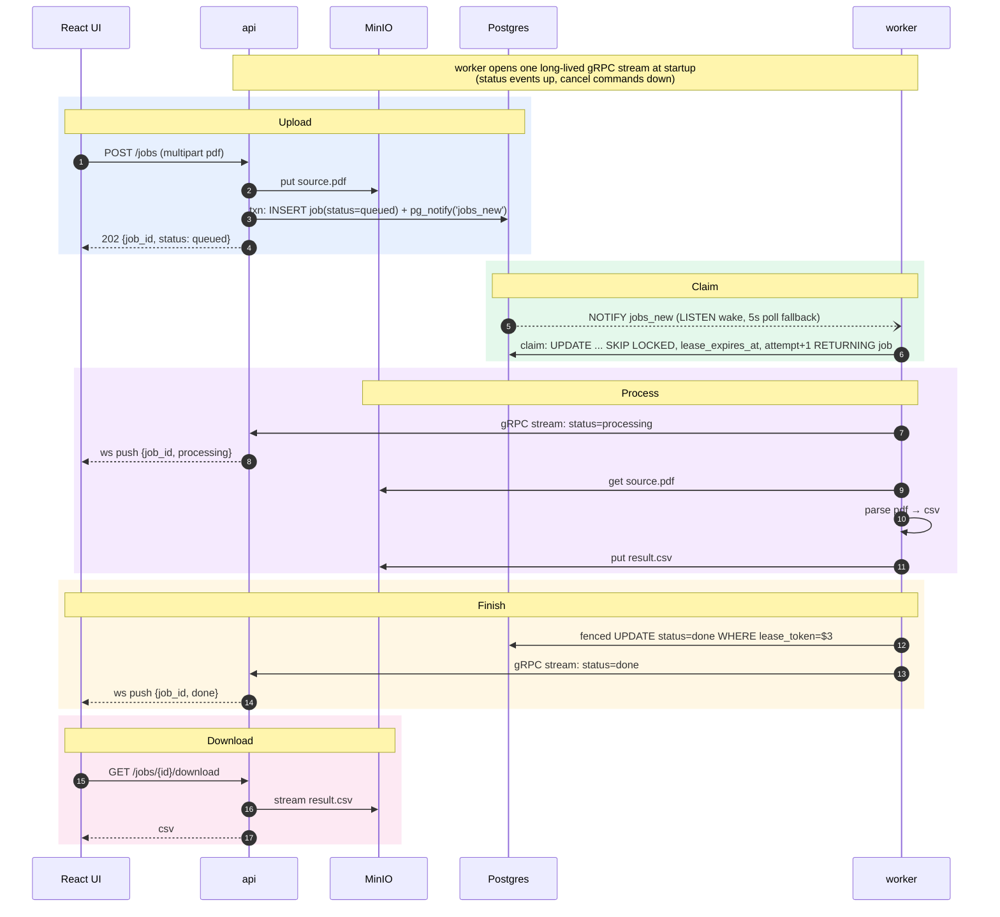

# PDF Transaction Parser

Upload a bank-statement PDF, get it parsed to CSV asynchronously, watch the job status live, download the result.

```bash
docker compose up --build
# open http://localhost:8080
```

## Architecture



Division of labor — each component does the one thing it's good at:

| Component | Role |
|---|---|
| **MinIO (S3)** | The bytes. `jobs/{id}/source.pdf` and `jobs/{id}/result.csv`. Blobs never touch the db. |
| **Postgres** | The truth **and** the queue. One `jobs` table carries status, keys, error, and the lease columns (`attempt`, `lease_token`, `lease_expires_at`) that make it a claimable work queue — `FOR UPDATE SKIP LOCKED` for mutual exclusion, `pg_notify` for wake-up. No second system to keep in sync with the first. |
| **api (Go)** | HTTP: upload, list, download. Writes the pdf to MinIO, then inserts the job row and fires `pg_notify` inside one transaction. Websocket fan-out of status events. gRPC server for the workers' bidirectional event stream. |
| **worker (Go, ×2)** | Blocks on `LISTEN jobs_new` (5s poll fallback), claims a job with `SKIP LOCKED` + a lease, downloads the pdf, parses to csv, uploads the result, and finishes with a fenced terminal `UPDATE`. Holds one long-lived gRPC stream to the api for the life of the process: status events up, cancel commands down. |

## Job lifecycle



Status flow: `queued → processing → done | failed`.

## Design decisions

- **No dual write, by construction.** The enqueue *is* the `INSERT`. `pg_notify('jobs_new', …)` fires inside the same transaction as the row insert — Postgres holds the notification until commit and discards it on rollback, so there's no window where the row exists and the signal doesn't, or vice versa. An earlier version of this design produced to a separate broker after inserting the row; a produce failure after a successful insert stranded the job at `queued` forever, with nothing to notice. The textbook fix is a transactional outbox — but an outbox relay is itself a `SELECT … FOR UPDATE SKIP LOCKED` poller over a table, which means building the hard half of a Postgres queue and then handing the easy half to a broker that's no longer earning its place.
- **Write the blob before the pointer.** `api` puts the pdf to MinIO *before* it inserts the job row. If the process dies between those two steps, the result is an orphaned object in MinIO with no row pointing at it — garbage, cleanable by a lifecycle rule, never looked at again. The reverse order (row first, blob second) would produce a job the worker can claim and then fail to find its source pdf for — a correctness bug, not a janitorial one. Commit the pointer last.
- **The claim is a lease, not a lock.** The claim query runs `FOR UPDATE SKIP LOCKED` inside a transaction that commits immediately — the row lock lives for microseconds, not for the 30 seconds it takes to parse a PDF. Mutual exclusion for the actual work is carried by the `lease_expires_at` *value*, not by a held lock. Holding the transaction open for the job's duration would pin a connection, block vacuum, and bloat the table.
- **Crash recovery is lease expiry, not a special code path.** A worker killed mid-parse leaves its row at `processing` with a lease that's about to expire; the same claim query reclaims it once `lease_expires_at < now()` — no separate requeue logic needed. `attempt` bounds the retries, and a small janitor (one `UPDATE` on a ticker) moves rows past `max_attempts` to `failed` so they stop being reclaimed forever.
- **The fencing token.** A worker that's alive but merely partitioned from the db doesn't know its lease expired, so a second worker can legitimately claim the same job — both now run concurrently. The terminal write is fenced on the lease: `UPDATE jobs SET status='done', csv_key=$2 WHERE id=$1 AND lease_token=$3`. The stale worker's write matches zero rows and it knows it lost the race. The duplicate MinIO write is harmless because the csv key is deterministic (`jobs/{id}/result.csv`) — at-least-once delivery, effectively-once effects.
- **NOTIFY is an optimization, not a correctness dependency.** Postgres notifications are connection-scoped, not durable, need a dedicated unpooled connection (PgBouncer in transaction mode silently drops `LISTEN` registrations), and a subscriber that isn't connected at delivery time simply misses the event with no replay. So the worker loop doesn't depend on it: claim in a tight loop until empty, then block on `WaitForNotification` with a 5-second timeout, then loop again. Losing every single notification costs up to 5 seconds of latency and never costs a job — correctness comes entirely from the claim query.
- **Why gRPC is a stream, not a unary call.** A single fire-and-forget `NotifyStatus` RPC is barely more than an HTTP POST with extra build steps, and it invites the obvious question: "why not just have the api `LISTEN` too?" The answer is that `pg_notify` is a broadcast primitive and cancellation is a routing problem — when a user clicks Cancel, the api needs to reach the *one* worker currently holding that job's lease, not every worker. So each worker opens a single long-lived bidirectional stream at startup: status events flow up, control commands (cancel) flow down. One connection instead of one dial per event, worker liveness for free (stream closes → worker is gone → the api can shorten that worker's leases), and a real reconnect-with-backoff story.
- **Why csv goes to MinIO, not Postgres.** The result is a blob; databases are bad at blobs (table bloat, no streaming, every download proxied through the db connection). Postgres stores the *pointer* (`csv_key`), which is what makes "download it again later" work.
- **Websocket is a hint, not the truth.** Push events can be missed (reconnect, race with subscribe). The UI fetches `GET /jobs` on load/reconnect and treats ws events as incremental updates on top. State in Postgres is authoritative.
- **Why Kafka was removed, and what would bring a broker back.** Kafka's offset model is a replayable log high-water mark; a work queue needs per-message ack. Bridging those two things is real, subtle code — abandon-the-fetch-batch logic, stall backoff, a two-phase requeue dance — to compensate for the central abstraction being wrong for the job. I'd reach for a broker again at specific thresholds: a sustained enqueue rate past what a single Postgres instance can claim against, a second independent consumer group that needs the same event stream, or an actual replay/retention requirement. If I needed one at *this* scale, I'd pick NATS JetStream over Kafka, not the other way back — `WorkQueuePolicy` retention deletes a message on ack (an actual queue, not a log pretending to be one), per-message `AckWait` redelivery and `MaxDeliver` replace the hand-rolled retry entirely, consumers aren't capped by partition count, and it ships as a single ~20MB binary. And for the queue mechanism itself: in production I'd reach for [River](https://riverqueue.com/) rather than hand-rolling `SKIP LOCKED` + leases — I wrote it out explicitly here because the claim/lease/fencing/retry story is the interesting part of this exercise, and River's whole point is that you never have to think about it.
- **`PARSE_DELAY`** (worker env, default `2s`): artificial processing delay so the `processing` state is actually visible in a demo; set to `0` for real speed.
- **Compose parallels k8s.** `deploy: replicas: 2` ≈ Deployment replicas; healthcheck-gated `depends_on` ≈ readiness probes.

## Repo layout

```
├── docker-compose.yml       # the whole system: infra + services, one command
├── proto/                   # jobs.proto (gRPC contract) + committed generated code
├── services/
│   ├── api/                 # cmd/api, internal/{config,app,...}
│   └── worker/              # cmd/worker, internal/{config,app,...}
├── tools/pdfgen/            # CLI: generates sample statement pdfs in the parser's layout
└── web/                     # React UI
```

Go services follow [golang-standards/project-layout](https://github.com/golang-standards/project-layout) (`cmd/` + `internal/`), CLIs are cobra-based, services configure via env vars (12-factor).

## The parsing contract

Real-world pdf parsing is a product in itself (layouts, scans, OCR). This demo scopes it honestly: `tools/pdfgen` generates statements in a fixed layout (`Date | Description | Amount | Balance`), and the worker parses exactly that layout using text extraction.

What guarantees the two agree is pdfgen's own round-trip test: it renders a statement, extracts it back with the same library the worker's parser uses (`ledongthuc/pdf`), and asserts every cell of every page comes out byte-identical to the in-memory statement — title, account line, period line, four column headers, four cells per row, page footer. That extracted cell sequence *is* the contract the parser codes against. On the worker side, `internal/parser` parses committed fixture pdfs and checks shape, field formats and pinned first/last rows.

Uploading an arbitrary real-bank pdf will land the job in `failed` — by design, and the error is visible in the UI.

## Ports

| Service | Port | |
|---|---|---|
| api | 8080 | HTTP + UI |
| api | 9090 | gRPC (internal) |
| MinIO console | 9001 | login `minioadmin`/`minioadmin` |
| Postgres | 5432 | `mls`/`mls`, db `mls` |
